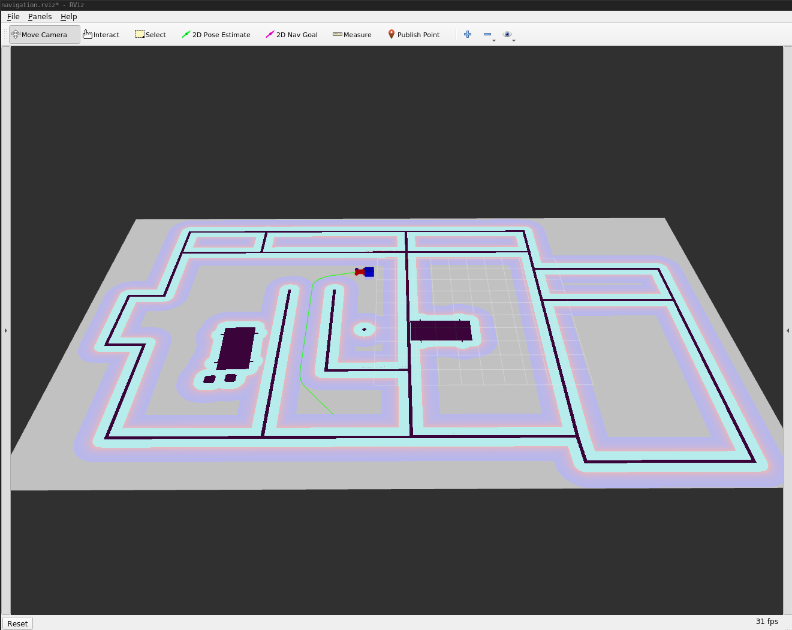

## Q802 Home Service Robot



### Overview

This project simulates a service robot capable of navigating to pick up zones, 
picking up virual objects and delivering them to the destination zones. 

### Installation

```bash
# system
$ sudo aptitude install ros-noetic-navigation
$ sudo aptitude install ros-noetic-map-server
$ sudo aptitude install ros-noetic-move-base
$ sudo aptitude install ros-noetic-amcl
$ sudo aptitude install ros-noetic-openslam-gmapping
$ sudo aptitude install ros-noetic-joy

$ mkdir -p catkin_ws/src && cd catkin_ws/src
$ catkin_init_workspace

# gmapping
$ git clone git@github.com:ros-perception/slam_gmapping.git

# keyboard for initial manual control
$ git clone https://github.com/ros-teleop/teleop_twist_keyboard

# If using the TurtleBot consider the below.  
# However I am using the below a skid-steer robot in home_service_robot

# Utilizing the view_navigation.launch file, we'll load a preconfigured rviz workspace. 
# thus saving time as it will automatically load the robot model, trajectories, and map.
# $ git clone git@github.com:turtlebot/turtlebot_interactions.git

# With the turtlebot_world.launch we'll deploy a turtlebot in a gazebo environment 
# by linking the world file to it.
# $ git@github.com:turtlebot/turtlebot_simulator.git
```

### Mapping Q802

A map prior has been built via RTAB-Map in [MapMyQ802](https://github.com/jfinken/MapMyQ802).
See that project for full details, this map is used here.

However, the gmapping ROS1-noetic package is installed per-above, and can be
used via the skid-steer roboto to map a new environment.

```bash
$ roslaunch home_service_robot world.launch

# NOTE: the base_frame of my skid-steer robot is "chassis"
$ rosrun gmapping slam_gmapping scan:=scan _base_frame:=chassis
```

### Localization and Path-Planning for home-service functionality

The core launch script powering the Home Service Robot is: [scripts/home_service.sh](scripts/home_service.sh).
It runs the following launch files:

[world.launch](home_service_robot/launch/world.launch)

- This will launch gazebo, the skid-steer robot, and place the robot in the Q802
world model.  It also launches rviz auto-loading the navigation.rviz config.

[amcl.launch](home_service_robot/launch/amcl.launch)

- Launches the AMCL and Navigation (move_base) stacks.  Again, a map prior has 
been built via RTAB-map in ROS1-noetic, and that map is loaded by the amcl node.  At
this stage, in Rviz, the AMCL particles are visible as is the map.

[add_markers.launch](add_markers/launch/add_markers.launch)

- Launches the add_markers node.  This node subscribes to `pick_objects/Zone` messages 
on the `/home_service_robot/zone` topic, and publishes visualization markers to the 
`/visualization_marker` topic.  These markers are rendered in rviz.

[pick_objects.launch](pick_objects/launch/pick_objects.launch)
- Launches the pick_objects node.  This node contains hard-coded Poses directing
the robot to destination locations via MoveBaseGoal messages.  Upon
successfully reaching each goal the node will publish a Zone message.

### Tuning Notes

- The skid-steer robot has trouble arriving at the exact position and orientations 
specified in [pick_objects/src/pick_objects.cpp](pick_objects/src/pick_objects.cpp).
Hence the very generous `yaw_goal_tolerance` and `xy_goal_tolerance` values,
for the navigation stack, in `base_local_planner_params.yaml`.

- Furthermore, see the costmap `inflation_radius` value in `costmap_common_params.yaml`.
It is a large inflation value specifically for path-planner safety for the skid-steer robot.  And
finally the robot's `footprint` is specified there as well.